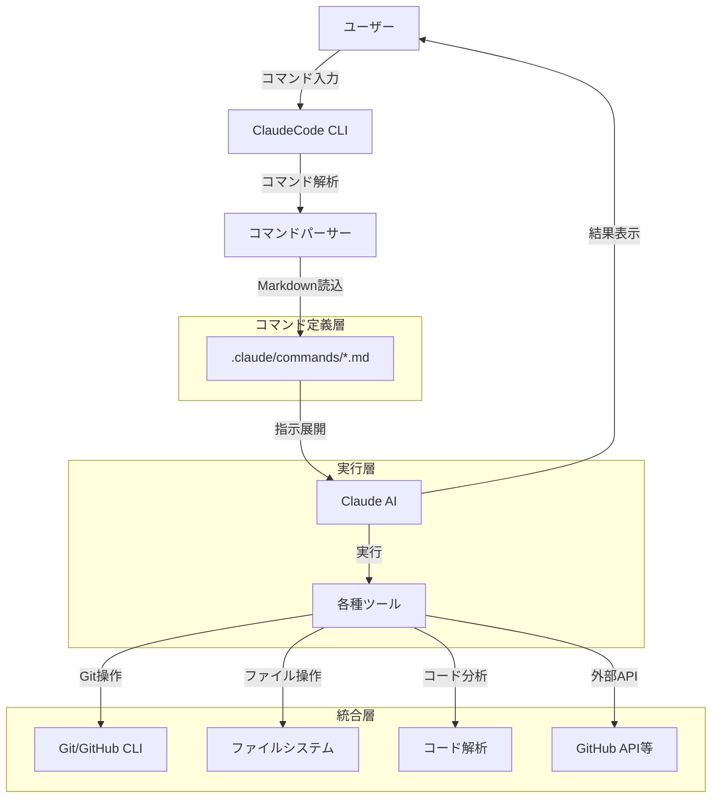
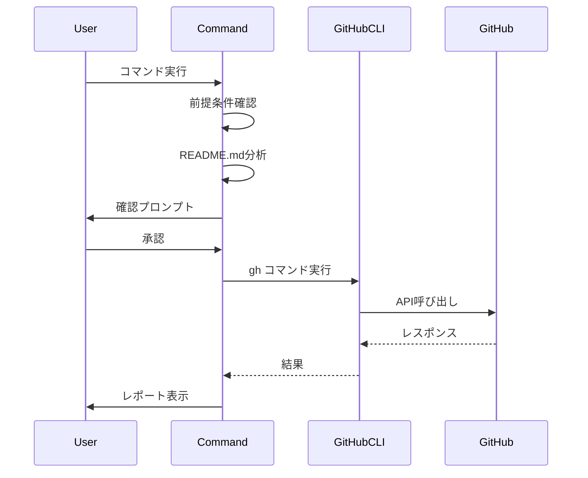
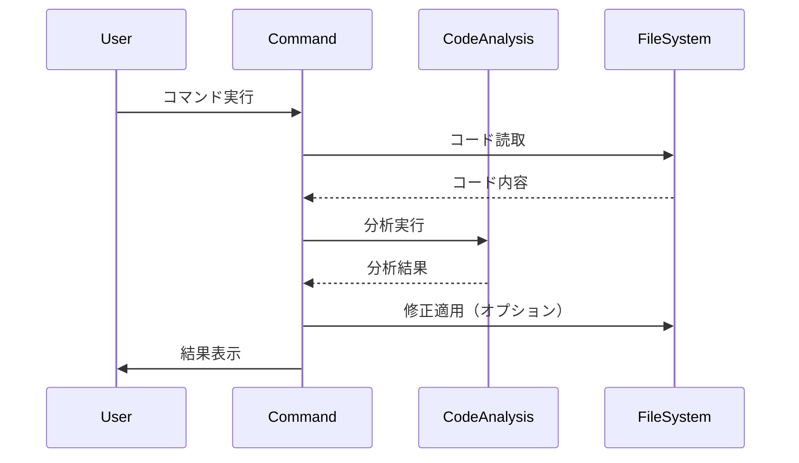

# アーキテクチャドキュメント

このドキュメントでは、ClaudeCode Command Template の内部構造と設計思想について説明します。

## 目次

- [システム概要](#システム概要)
- [コマンドシステムの設計](#コマンドシステムの設計)
- [ディレクトリ構造](#ディレクトリ構造)
- [コマンドの実行フロー](#コマンドの実行フロー)
- [拡張方法](#拡張方法)
- [ベストプラクティス](#ベストプラクティス)

## システム概要

ClaudeCode Command Template は、ClaudeCode のカスタムコマンド（スラッシュコマンド）機能を活用した、開発ワークフロー自動化システムです。

### 設計原則

1. **宣言的設定**: コマンドはMarkdownファイルで宣言的に定義
2. **モジュール性**: 各コマンドは独立して動作し、相互依存を最小化
3. **拡張性**: 新しいコマンドを簡単に追加できる構造
4. **再利用性**: テンプレートとして他のプロジェクトで再利用可能
5. **TDD重視**: すべてのワークフローがテスト駆動開発を前提

### アーキテクチャ図



## コマンドシステムの設計

### コマンドの構造

各コマンドは以下の構造を持ちます:

```markdown
---
description: コマンドの簡潔な説明（/helpで表示）
---

## 前提条件の確認（オプション）
- 実行前に確認すべき事項
- 必要な認証や設定

## タスクの実行
1. ステップ1の説明
2. ステップ2の説明
   - サブステップ
   - 具体的な手順

## オプション引数（オプション）
- --option1: 説明
- --option2: 説明

## 注意事項（オプション）
- 重要な注意点
- エラー処理
```

### コマンドのカテゴリ

コマンドは機能ごとに以下のカテゴリに分類されます:

#### 1. GitHub統合コマンド（`gh-*.md`）

**目的**: GitHubとの連携を自動化

**特徴**:
- GitHub CLIへの依存
- Issue/PR/Projectsの管理
- README.mdからの情報抽出

**主要コマンド**:
- `/gh-template`: テンプレート・ラベル・マイルストーン作成
- `/gh-project`: GitHub Projectsの作成と設定
- `/gh-issues-from-readme`: Issue一括作成
- `/gh-issue`: Issue駆動開発
- `/gh-bug-create`, `/gh-feature-create`: 個別Issue作成

**設計パターン**:


#### 2. コード品質コマンド

**目的**: コード品質の向上と保守性の確保

**特徴**:
- 静的解析とリファクタリング
- ドキュメント生成
- テスト生成

**主要コマンド**:
- `/explain`: プロジェクト説明
- `/improve`: 改善提案
- `/test`: テスト生成
- `/refactor`: リファクタリング実行
- `/fix-lint`: Lint自動修正
- `/docs`: ドキュメント生成
- `/pr-review`: PRレビュー

**設計パターン**:


### 権限管理

`.claude/settings.local.json` で実行可能なコマンドを制御:

```json
{
  "permissions": {
    "allow": [
      "Bash(gh:*)",      // GitHub CLI全般
      "Bash(git:*)",     // Git操作全般
      "Bash(test:*)",    // テストコマンド
      "Bash(npm:*)",     // npm操作
      "Bash(python:*)",  // Python実行
      "Bash(black:*)",   // Pythonフォーマッタ
      "Bash(ruff:*)",    // Pythonリンター
      "Bash(mypy:*)"     // Python型チェック
    ]
  }
}
```

**設計意図**:
- プレフィックスマッチング（`:*`）で柔軟な権限管理
- セキュリティとユーザビリティのバランス
- プロジェクト固有のツールを追加可能

## ディレクトリ構造

```
.claude/
├── commands/              # コマンド定義ディレクトリ
│   ├── gh-*.md           # GitHub統合コマンド
│   ├── *.md              # コード品質コマンド
│   └── [custom].md       # カスタムコマンド
└── settings.local.json   # 権限設定

how_to_vibe_coding/       # ドキュメントディレクトリ
├── COMMANDS.md           # コマンドリファレンス
└── ARCHITECTURE.md       # このファイル

.github/                  # GitHub設定（動的生成）
├── PULL_REQUEST_TEMPLATE.md
└── ISSUE_TEMPLATE/
    ├── bug_report.md
    └── feature_request.md

README.md                 # プロジェクト概要
CLAUDE.md                 # Claude Code用プロジェクト説明
LICENSE                   # ライセンス
```

### ファイル命名規則

**コマンドファイル**:
- `gh-*.md`: GitHub関連機能
- `*.md`: 汎用機能
- ファイル名 = コマンド名（例: `docs.md` → `/docs`）

**ドキュメントファイル**:
- `COMMANDS.md`: ユーザー向けリファレンス
- `ARCHITECTURE.md`: 開発者向けアーキテクチャ
- `README.md`: プロジェクト概要と使い方

## コマンドの実行フロー

### 1. コマンド呼び出し

```
ユーザー入力: /gh-template
```

### 2. コマンドファイル解析

ClaudeCodeが `.claude/commands/gh-template.md` を読み込み:
- Frontmatterから`description`を取得
- 本文を実行指示として解釈

### 3. 実行計画の生成

Claude AIが以下を実行:
1. 前提条件の確認
2. 必要な情報の収集（README.md等）
3. ユーザーへの確認プロンプト
4. 承認後の実行

### 4. ツール呼び出し

利用可能なツール:
- `Bash`: シェルコマンド実行
- `Read`: ファイル読取
- `Write`: ファイル書込
- `Edit`: ファイル編集
- `Glob`: ファイル検索
- `Grep`: コンテンツ検索

### 5. 結果の報告

構造化された結果をユーザーに提示:
```markdown
## 作成完了

### 作成されたリソース
- リソース1
- リソース2

### 次のステップ
- 推奨される次のアクション
```

## 拡張方法

### 新しいコマンドの追加

1. **コマンドファイルの作成**

```bash
touch .claude/commands/my-command.md
```

2. **コマンド定義の記述**

```markdown
---
description: 私のカスタムコマンド
---

## タスクの実行

1. タスクの目的を理解する
2. 必要なファイルを読み取る
3. 処理を実行する
4. 結果を報告する

$ARGUMENTS で引数を参照できます。
```

3. **権限の追加（必要に応じて）**

`.claude/settings.local.json`:
```json
{
  "permissions": {
    "allow": [
      "Bash(my-tool:*)"
    ]
  }
}
```

4. **ドキュメントの更新**

- `README.md`: コマンド一覧に追加
- `how_to_vibe_coding/COMMANDS.md`: 詳細リファレンスに追加

### 既存コマンドのカスタマイズ

1. **コマンドファイルの編集**

```bash
# 例: /gh-template のカスタマイズ
code .claude/commands/gh-template.md
```

2. **ステップの追加・変更**

```markdown
### 5. カスタムステップ

1. 独自の処理を追加
2. プロジェクト固有のラベルを作成
```

3. **変更のテスト**

```bash
# コマンドを実行して動作確認
/gh-template --dry-run
```

### README.md駆動の設計

多くのコマンドは `README.md` から情報を抽出します:

**抽出される情報**:
- プロジェクト名と概要
- 主要機能リスト
- 技術スタック
- マイルストーン・バージョン
- 開発フェーズ

**設計意図**:
- 単一の真実の情報源（README.md）
- ドキュメント駆動開発
- 自動化とドキュメントの同期

## ベストプラクティス

### コマンド設計

1. **明確な責務**: 各コマンドは単一の明確な目的を持つ
2. **ユーザー確認**: 破壊的操作の前に必ず確認を求める
3. **エラーハンドリング**: エラー時の対応を明示する
4. **段階的実行**: 大きなタスクを小さなステップに分割
5. **結果の報告**: 実行結果を構造化して表示

### コード例

**良い例**:
```markdown
1. **README.mdの読み取り**
   - ファイルが存在しない場合はデフォルト値を使用
   - エラーメッセージを表示してユーザーに通知

2. **ユーザーへの確認**
   - 作成予定のリソース一覧を表示
   - ユーザーの承認を待つ

3. **リソースの作成**
   - 各リソースを順次作成
   - 既存リソースがある場合はスキップ
```

**悪い例**:
```markdown
1. README.mdを読んでリソースを作成する
```

### ドキュメント作成

1. **構造化**: 明確な見出しとセクション
2. **具体例**: 抽象的な説明ではなく具体例を提供
3. **完全性**: 前提条件、実行手順、結果をすべて記載
4. **更新性**: コマンド変更時にドキュメントも更新

### テストとデバッグ

1. **ドライラン**: `--dry-run` オプションでテスト
2. **段階的確認**: 各ステップ後に結果を確認
3. **ログ出力**: 実行内容を詳細に報告
4. **ロールバック**: 失敗時の復旧手順を用意

## パフォーマンス考慮事項

### 最適化のポイント

1. **並列実行**: 独立した操作は並列で実行
2. **キャッシュ活用**: 同じ情報の重複読取を避ける
3. **不要な操作の削減**: 既存リソースのチェックを行う
4. **バッチ処理**: 大量の操作はバッチで実行

### リソース管理

1. **ファイルI/O**: 必要最小限の読書きに抑える
2. **API呼び出し**: レート制限を考慮
3. **メモリ使用**: 大きなファイルの分割処理

## セキュリティ考慮事項

### 権限管理

1. **最小権限の原則**: 必要な権限のみを許可
2. **明示的な承認**: 重要な操作は必ず確認
3. **認証情報**: GitHub CLIの認証を活用

### データ保護

1. **機密情報**: `.env`や認証情報を扱わない
2. **ログ出力**: パスワード等をログに残さない
3. **一時ファイル**: 処理後に削除

## トラブルシューティング

### よくある問題

1. **GitHub CLI認証エラー**
   - 原因: 未認証または期限切れ
   - 解決: `gh auth login` で再認証

2. **権限エラー**
   - 原因: `.claude/settings.local.json` の設定不足
   - 解決: 必要な権限を追加

3. **コマンドが見つからない**
   - 原因: ファイル名とコマンド名の不一致
   - 解決: ファイル名を確認

### デバッグ方法

1. **コマンドファイルの確認**: Markdown構文の検証
2. **ステップ実行**: 各ステップを個別に確認
3. **ログ確認**: ClaudeCodeの出力を精査

## 今後の拡張可能性

### 計画中の機能

1. **CI/CD統合**: GitHub Actionsの自動生成
2. **多言語対応**: 他の言語プロジェクトへの対応拡大
3. **テンプレートライブラリ**: コマンドテンプレートの共有
4. **分析機能強化**: より高度なコード分析

### コミュニティへの貢献

- 新しいコマンドの提案
- ドキュメントの改善
- バグ報告と修正
- 使用事例の共有

## 参考資料

- [ClaudeCode公式ドキュメント](https://github.com/anthropics/claude-code)
- [GitHub CLI](https://cli.github.com/)
- [Markdown仕様](https://commonmark.org/)
- [Mermaid図表記法](https://mermaid.js.org/)
